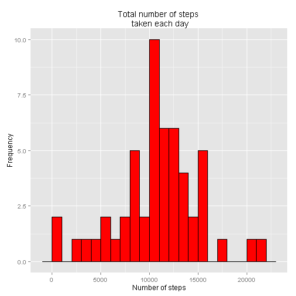
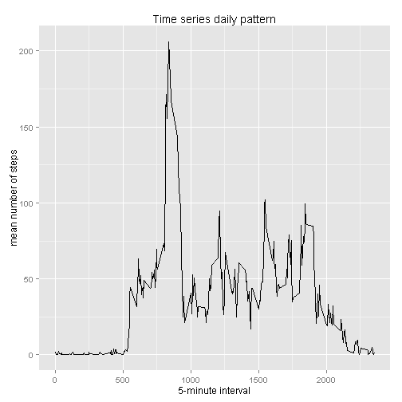
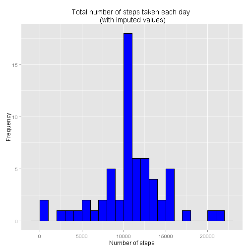

      
### Loading and preprocessing the data


```r
setwd("C:/Users/AJ/RepData_PeerAssessment1")

file_url <- "https://d396qusza40orc.cloudfront.net/repdata%2Fdata%2Factivity.zip"
file_location <- "./data/repdata%2Fdata%2Factivity.zip"

if (!file.exists("data")) {
      dir.create("data")
}

if (!file.exists(file_location)) {
      download.file(file_url, destfile=file_location)
      date <- date()
      date
      unzip(file_location, exdir="./data")
}

activity_data <- read.csv("./data/activity.csv")
activity_data$date <- as.Date(activity_data$date,"%Y-%m-%d")
Sys.setlocale(locale = "English")

str(activity_data)
head(activity_data)
```
      
### What is mean total number of steps taken per day?

For this part of the assignment, we are going to ignore the missing values in the dataset.

1. Make a histogram of the total number of steps taken each day


```r
library(ggplot2)

total_steps_day <- aggregate(steps ~ date, data=activity_data, FUN=sum)

ggplot(total_steps_day, aes(x=steps)) + 
      geom_histogram(binwidth=1000, color="black", fill="red") +
      ggtitle("Total number of steps \n taken each day") +
      xlab("Number of steps") +
      ylab("Frequency")
```

 

2. Calculate and report the mean and median total number of steps taken per day


```r
mean(total_steps_day$steps, na.rm = TRUE)
```

```
## [1] 10766.19
```

```r
median(total_steps_day$steps, na.rm = TRUE)
```

```
## [1] 10765
```
      
### What is the average daily activity pattern?

1. Make a time series plot (i.e. type = "l") of the 5-minute interval (x-axis) and the average number of steps taken, averaged across all days (y-axis)


```r
mean_steps_interval <- aggregate(steps ~ interval, data=activity_data, FUN=mean)

ggplot(mean_steps_interval, aes(x=interval, y=steps)) + geom_line() +
      ggtitle("Time series daily pattern") +
      xlab("5-minute interval") +
      ylab("mean number of steps")
```

 

2. Which 5-minute interval, on average across all the days in the dataset, contains the maximum number of steps?


```r
mean_steps_interval$interval[which.max(mean_steps_interval$steps)]
```

```
## [1] 835
```


### Imputing missing values

1. Calculate and report the total number of missing values in the dataset (i.e. the total number of rows with NAs)


```r
sum(is.na(activity_data))
```

```
## [1] 2304
```

2. Devise a strategy for filling in all of the missing values in the dataset.  The strategy does not need to be sophisticated. For example, you could use the mean/median for that day, or the mean for that 5-minute interval, etc.

After trying a lot of stuff, I ended up implementing the following method, as seen in [Stack Overflow](http://stackoverflow.com/a/9322975/3657371)


```r
library(plyr)

impute.mean <- function(x) replace(x, is.na(x), mean(x, na.rm = TRUE))

activity_data2 <- plyr::ddply(activity_data[1:3], .(interval), transform,
                                steps = impute.mean(steps),
                                date = date,
                                interval = interval)
```

3. Create a new dataset that is equal to the original dataset but with the missing data filled in.

It was created on the last step. Here we can check that there are no missing values in activity_data2

```r
sum(is.na(activity_data2))
```

```
## [1] 0
```

4. Make a histogram of the total number of steps taken each day and Calculate and report the mean and median total number of steps taken per day. Do these values differ from the estimates from the first part of the assignment? What is the impact of imputing missing data on the estimates of the total daily number of steps?


```r
total_steps_day_new <- aggregate(steps ~ date, data=activity_data2, FUN=sum)

ggplot(total_steps_day_new, aes(x=steps)) + 
      geom_histogram(binwidth=1000, color="black", fill="blue") +
      ggtitle("Total number of steps taken each day \n (with imputed values)") +
      xlab("Number of steps") +
      ylab("Frequency")
```

 

The new distribution, with the imputed values, seems to be more centered as shown in
the histogram.


```r
mean(total_steps_day_new$steps)
```

```
## [1] 10766.19
```

```r
median(total_steps_day_new$steps)
```

```
## [1] 10766.19
```
Mean and median are equal, because of NA imputation using mean values.


### Are there differences in activity patterns between weekdays and weekends?

1. Create a new factor variable in the dataset with two levels - "weekday" and "weekend" indicating whether a given date is a weekday or weekend day.


```r
weekDayType <- function(date) {
      if (weekdays(as.Date(date)) %in% c("Saturday", "Sunday")) {
            "weekend"
      } else {
            "weekday"
      }
}
```

The new variable can be seen below:

```r
activity_data2$week_day_type <- as.factor(sapply(activity_data2$date, weekDayType))
head(activity_data2)
```

```
##       steps       date interval week_day_type
## 1  1.716981 2012-10-01        0       weekday
## 2  0.000000 2012-10-02        0       weekday
## 3  0.000000 2012-10-03        0       weekday
## 4 47.000000 2012-10-04        0       weekday
## 5  0.000000 2012-10-05        0       weekday
## 6  0.000000 2012-10-06        0       weekend
```

2. Make a panel plot containing a time series plot (i.e. type = "l") of the 5-minute  interval (x-axis) and the average number of steps taken, averaged across all weekday days or weekend days (y-axis). See the README file in the GitHub repository to see an example  of what this plot should look like using simulated data.


```r
mean_steps <- aggregate(steps~interval+week_day_type, FUN=mean, data=activity_data2)
      
ggplot(mean_steps, aes(x=interval, y=steps)) + geom_line() +
      facet_grid(week_day_type ~. ) +
      ggtitle("Comparing weekdays and weekedns on mean steps \n over 5 minute intervals") +
      xlab("Interval") +
      ylab("steps")
```

 


